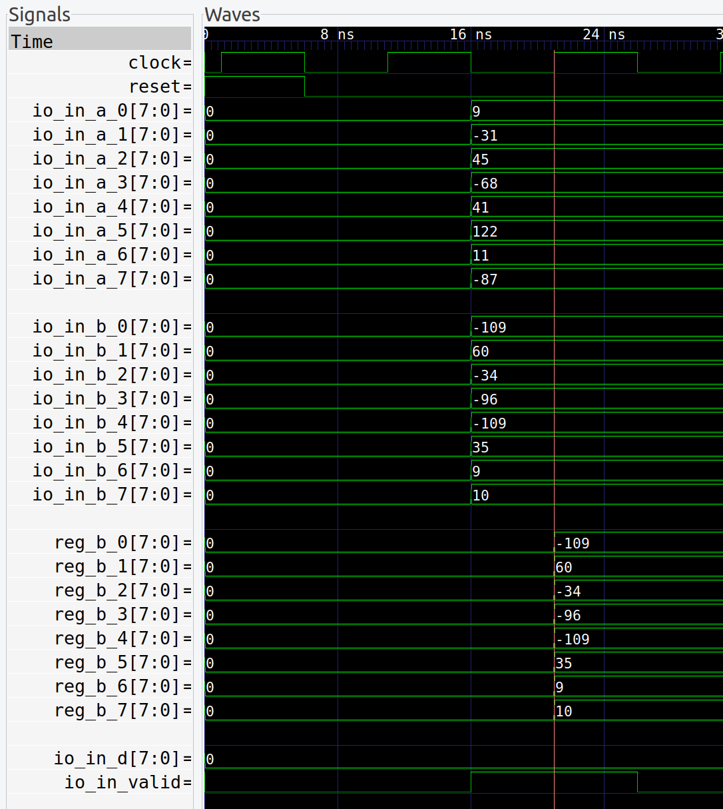

## Bitlet-PE（int8） for chisel
Bitlet: A bit-level sparsity-awared multiply-accumulate process element in HDL.
## Publication
https://luhang-hpu.github.io/files/bitlet-MICRO21.pdf

## the verilog HDL version 
https://github.com/Zhu-Zixuan/Bitlet-PE

## The ONNX Simulation
https://github.com/Chen-gz233/Bitlet-CLike 

## Bitlet 模块说明

### Top

io | 功能|
---|-----
`in_a` |  矩阵A输入
`in_b` | 矩阵B输入
`in_valid` | 输入有效信号
`in_d` | 偏置数
`dataOut` | 输出矩阵
`out_valid` | 输出有效信号

**`reg_b`** ： 使用`WS` 模式，因此将weight矩阵保存在计算单元中

### **预处理阶段**

**`sign`矩阵** :将输入的两个矩阵对应位置元素做异或(`^`)得到对应的符号位 ： $sign(i) = A(i)  $^$  B(i)$

**`amanti`** : 输入A矩阵中的每一个元素去除符号位后的尾数

**`wmanti`** : 输入B矩阵中的每一个元素去除符号位后的尾数

**tip** :在处理尾数的时候，输入数据必须符合IEEE754标准，对于负数采用补码形式。取尾数的时候，要使用取反+1的操作。

### shiftOrchestModule 模块

这个模块将输入的**wmanti**矩阵数据拆分成“0 或 1”

io |功能 |
---|-----
`wManti` |  输入矩阵(64 * 8)  64(8*8)个元素，每个元素位宽是8  
`in_b` | 输出矩阵 (8*64) 8行数据，每行64个`Bool`类型元素   

**这里做了一个逆时针旋转90度的操作**

我们的输入数据是$64*8bit$ 
输出数据是$8 * 64bit$

这种操作的目的是将`wmanti`中的数据按位提取，因为不同的位有不同的权重。因此得出`sewo`中每行数据的权重不同。

### RRreg 模块

在这个模块中，`aManti`是之前取出符号位的矩阵`A`。应该有`64`个`8`位宽数据，这里做简化只显示了`0-7`个。

`sign`是预处理后的数据，表示矩阵`A`和矩阵`B`中对应位置的元素符号位做异或`^`操作，也就是对应位置相乘后的符号。

`sewo`是`shiftOrchestModule`模块将`wmanti`处理后的数据，`sewo`总过有`8`组每组`64`位。

上面提到`sewo`中的`8`组数据是根据不同的权重来分配的。在二进制乘法中的权重也就是数据位移操作。

`sewo(0)`中第一组数据权重为`0`,`sewo(1)`中第一组数据权重为`1`,以此类推。因此`sewo(i)`在与`aManti`做乘法时，就是将`aManti`左移`i`位，再补上符号位。这就是`Bitlet`模块中最重要的计算方式，对应`decoderRR_not_fixed`代码中的`UIntShiftToSInt_int8`函数。

### decoderRR_not_fixed 模块

**无符号数到有符号数的转换**：
   - 使用 `UIntShiftToSInt_int8` 函数，将无符号数右移并根据符号位扩展转为有符号数。

根据`sewo`中的数据，从低位到高位每`8`位取为`window`滑窗。

根据`window`在`num_table`获取29位宽的数据(`num_table_temp := num_table(window)`)，将`num_table`解码为`10`组数据(`ones`,`two_x`,`three_x`,`four_x`)。

在这里`ones`给滑窗中`1`的稀疏情况分等级:

- `ones=0` 时：滑窗`window`中有`0-1`个`1`,不需要标注`1`的位置(在滑窗的第几位); 

- `ones=1` 时：滑窗`window`中有`2`个`1`,`two_x` 用于标注滑窗`window`中`1`的位置;

- `ones=2` 时：滑窗`window`中有`3`个`1`,`three_x` 用于标注滑窗`window`中`1`的位置;

- `ones=2` 时：滑窗`window`中有`4`个`1`,`four_x` 用于标注滑窗`window`中`1`的位置;

- `ones=3` 时：滑窗中`1`的个数`>4`个，不用考虑稀疏性，直接计算。

根据`UIntShiftToSInt_int8`函数，将`io.sign`和`io.aManti`位移后结合，转为31位有符号数保存在`windowRegx_x`中，最后将这些有符号数相加。

**累加和溢出处理**：使用多个寄存器和 `Mux` 选择器实现累加操作。当多个累加结果需要输出时，使用 `SpillOver` 寄存器充当缓存队列。

 **输出结果**：根据有效信号 `valid_num` 和溢出寄存器 `SpillOver` 的状态，选择最终的累加结果输出到 `outNum`。

### AdderTree 模块
这个模块通过对输入数据向量`RRregOut`的各个元素进行累加操作，计算出累加结果`data`，并提供一个有效信号`out_valid`。

